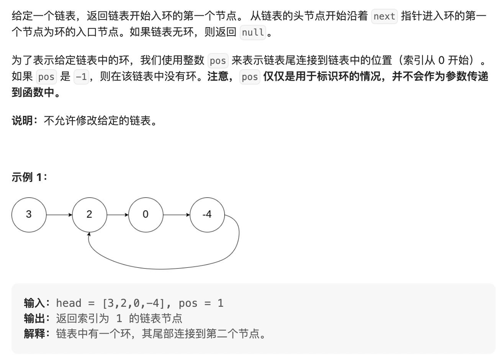
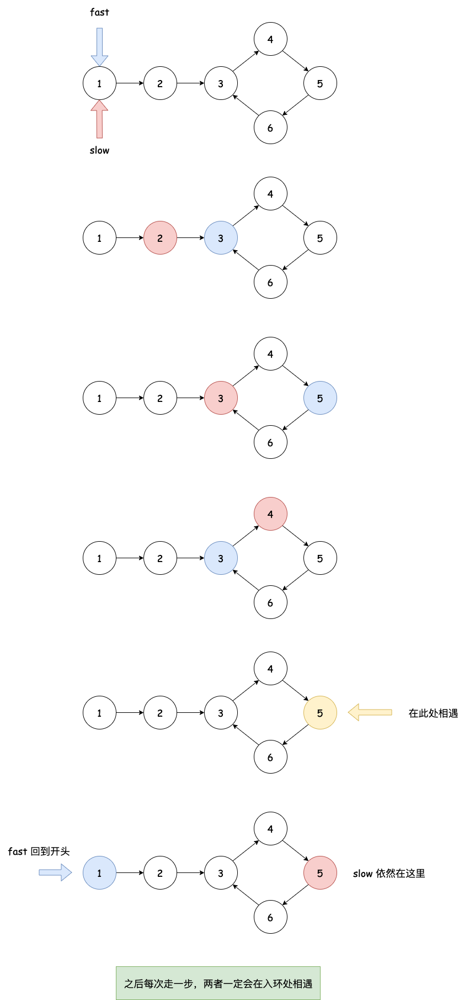

# 链表系列面试题

## 1. 链表的中间节点

难度：`easy`


1. 朴素解法：

- 遍历一遍单链表，取得单链表长度；

- 第二次遍历单链表，得到中间节点。

  ```java
  public ListNode middleNode(ListNode head) {
      // 统计节点个数
      int count = 0;
      ListNode p = head;
      while (p != null) {
        count++;
        p = p.next;
      }
      // 找中间节点
      int midIdx = count / 2;
      p = head;
      for (int i = 0; p != null; i++) {
        if (i == midIdx) {
          return p;
        }
        p = p.next;
      }
      return null;
  }
  ```

2. 面试官：你这个解法每个人都能想到，你能否通过遍历一次链表就找到中间节点？

   **快慢指针，快指针每次走一步，慢指针每次走两步，当快指针走到链表尾部的时候，慢指针就来到了中间位置。**

   ```java
   public ListNode middleNode(ListNode head) {
       ListNode fast = head, slow = head;
       while (fast != null && fast.next != null) {
         fast = fast.next.next;
         slow = slow.next;
       }
       return slow;
   }
   ```

进阶：找出链表的倒数第 $n$ 个节点。


## 2. 回文链表

难度：`easy`


1. 朴素解法：

- 第一次遍历：使用一个栈将所有节点的值入栈；

- 第二次遍历：遍历到每个节点时，从栈顶弹出值与节点比较，如果不相等返回 `false` ，如果最后都没有返回 `false` 就返回 `true`。

  ```java
  public boolean isPalindrome(ListNode head) {
      Stack<Integer> stack = new Stack<>();
      ListNode p = head;
      while (p != null) {
        stack.push(p.val);
        p = p.next;
      }
      p = head;
      while (p != null) {
        if (p.val != stack.pop()) {
          return false;
        }
        p = p.next;
      }
      return true;
  }
  ```

  时间复杂度：O(n) ，空间复杂度：O(n) 。

2. 面试官：你这个解法每个来面试的都能想到，你想赢过他们就想个空间复杂度 O(1) 的出来。

- 快慢指针找到链表的中间节点，如果有偶数个链表节点就找中间右边那个；
- 从中间节点开始，反转链表；
- 头尾双向双指针依次比较，如果值不一致返回 false 直到尾节点为 `null` 都没有返回就返回 true 。


```java
public boolean isPalindrome(ListNode head) {
    // 快慢指针找中间节点
    ListNode fast = head, slow = head;
    while (fast != null && fast.next != null) {
      fast = fast.next.next;
      slow = slow.next;
    }
    // 从 slow 开始，反转链表
    ListNode prev = null, cur = slow, nxt = slow.next;
    while (cur != null) {
      cur.next = prev;
      prev = cur;
      cur = nxt;
      if (nxt != null) nxt = nxt.next;
    }
    // 逐个比较
    ListNode p = head, q = prev;
    while (q != null) {
      if (p.val != q.val) return false;
      q = q.next;
      p = p.next;
    }
    return true;
}
```

时间复杂度：O(n) ，空间复杂度：O(1) 。


## 3. 重排单链表

难度：`middle`

将单链表按照某个值 k 进行划分，划分后单链表左边 <k ，中间 =k ，右边 >k 。

例如：

```
        单链表: 3 -> 2 -> 8 -> 5 -> 10 -> 5
	    k: 5 
------------------------------------------
          结果: 3 -> 2 -> 5 -> 5 -> 10 -> 8
这个结果也是对的: 2 -> 3 -> 5 -> 5 -> 8 -> 10
```

1. 朴素解法：

   容易看出，题目要求的这个划分过程就是**快速排序**的核心步骤，所以可以把链表每个节点都放到一个数组中，再进行快速排序的 **partition** 操作。

   ```java
   public ListNode listPartition(ListNode head, int pivot) {
     	List<ListNode> list = new ArrayList<>();
       ListNode p = head;
       while (p != null) {
         list.add(p);
         p = p.next;
       }
       // partition
       int less = -1, greater = list.size(); // 小于区域、大于区域的边界
       int i = 0;
       while (i < greater) {
         ListNode node = list.get(i);
         if (node.val < pivot) {
           // 与小于区域右边第一个元素交换
           ListNode temp = list.get(less + 1);
           list.set(++less, node);
           list.set(i++, temp);
         } else if (node.val > pivot) {
           // 与大于区域左边第一个元素交换
           ListNode temp = list.get(greater - 1);
           list.set(--greater, node);
           list.set(i, temp);
         } else {
           i++;
         }
       }
       // 按顺序串起来即可
       head = list.get(0);
       p = head;
       for (int j = 1; j < list.size(); j++) {
         p.next = list.get(j);
         p = p.next;
       }
       list.get(list.size()-1).next = null; // 断掉最后一个节点上的链
       return head;
   }
   ```

   时间复杂度：O(n) ，空间复杂度：O(n) 。

2. 面试官：你能否实现空间复杂度为 O(1) ？


## 4. 复杂链表的复制

难度：`middle`


1. 朴素做法：

   - 初次遍历，利用一个哈希表，Key 存储旧链表的节点，Value 存储对应新链表的节点；
   - 再次遍历旧链表，遍历到旧链表节点的时候，在哈希表中通过旧链表的 next 和 random 查出对应新链表节点的 next 和 random 。

   ```java
   public Node copyRandomList(Node head) {
       // 1. 哈希表存储旧链表节点和新链表节点
       Map<Node, Node> map = new HashMap<>();
       Node p = head;
       while (p != null) {
         map.put(p, new Node(p.val));
         p = p.next;
       }
       // 2. 调整哈希表中新链表节点的链
       p = head;
       while (p != null) {
         Node newNode = map.get(p);
         Node newNextNode = map.getOrDefault(p.next, null);
         Node newRandomNode = map.get(p.random);
         newNode.next = newNextNode;
         newNode.random = newRandomNode;
         p = p.next;
       }
       return map.get(head);
   }
   ```

   时间复杂度：O(n) ，空间复杂度：O(n) 。

2. 面试官：你能否实现空间复杂度为 O(1) ？

   - 遍历旧链表，遍历过程中创建新节点，新节点挂在旧节点的下一个，新节点的下一个指向旧节点的下一个；

   - 两两再遍历，此时处理新节点的 `random` 指针，可以通过旧节点的 `random` 的 `next` 找到新节点对应的指针；

   - 分离新旧链表。

     

     ```java
     public Node copyRandomList(Node head) {
         if (head == null) return null;
         // 复制新链表节点
         Node p = head;
         while (p != null) {
           Node nxt = p.next;
           p.next = new Node(p.val);
           p.next.next = nxt;
           p = nxt;
         }
         // 调 random 指针
         p = head;
         while (p != null) {
           // p 是老节点
           Node newNode = p.next;
           if (p.random != null)
             newNode.random = p.random.next;
           p = p.next.next;
         }
         // 分离新旧链表
         p = head;
         while (p != null) {
           Node newNode = p.next;
           Node oldNxt = newNode.next;
           if (oldNxt != null) newNode.next = oldNxt.next;
           p = oldNxt;
         } 
       	// 注意这里把旧链表的地址改了但没改回来
       	// 给 oj 平台会判错，需要把旧链表的各节点地址改回来
         return head.next;
     }
     ```

## 5. 相交链表系列问题

判断链表是否有环 - 难度：`easy`



1. 朴素做法

   哈希表，遍历链表 ，将节点一次入哈希表，遍历过程中，如果遍历到 null 了，说明没有环；如果遇到一个节点存在于哈希表中，说明存在环，且这个第一次出现在哈希表中的节点就是入环节点。

2. 能否用 O(1) 空间解决？**快慢指针**

   

   ```java
   public boolean hasCycle(ListNode head) {
       ListNode fast = head, slow = head;
       // 快慢指针
       while (fast != null && fast.next != null) {
         fast = fast.next.next;
         slow = slow.next;
         if (fast == slow) break;
       }
       if (fast == null || fast.next == null) return null; // 无环
       // 第二阶段
       fast = head;
       while (fast != slow) {
         fast = fast.next;
         slow = slow.next;
       }
       return fast;
   }
   ```
   


链表相交 - 难度：`easy`


1. 朴素做法

   哈希表，遍历其中一个链表，用哈希表记录每个节点；再遍历第二个链表，判断节点是否在哈希表中，第一个在哈希表中的节点即为第一个相交的起始节点。

2. 能否以 $O(1)$ 的空间复杂度解决这个问题？

   - 遍历其中一个链表，记录长度，计作 $len1$ ；
   - 再遍历另一个链表，记录长度，计作 $len2$ ；
   - 如果两个链表相交，那么上面两个遍历各自来到最后一个节点，此节点的地址一定相同，所以如果不相同就返回 null ；
   - 最后一个节点的地址相同，说明两个节点相交，假设 $len1 > len2$ ，让较长的链表 1 的指针从头开始，先走 $len1-len2$ 步，再让较短的链表 2 的指针从头开始，之后两个指针都一起向前走，那么它们一定会在相交的起始节点相遇。

```java
public ListNode getIntersectionNode(ListNode headA, ListNode headB) {
    ListNode pa = headA, pb = headB;
    int lenA = 1, lenB = 1;
    while (pa.next != null) {
      lenA++;
      pa = pa.next;
    }
    while (pb.next != null) {
      lenB++;
      pb = pb.next;
    }
    if (pa != pb) return null; // 没有相交
    // 统一让 headA 较长，headB 较短
    if (lenB > lenA) {
      ListNode tmp = headA;
      headA = headB;
      headB = tmp;

      int tmp2 = lenA;
      lenA = lenB;
      lenB = tmp2;
    }
    // 让较长的 A 先走 lenA - lenB 步
    pa = headA;
    int step = 0;
    while (step < lenA - lenB) {
      pa = pa.next;
      step++;
    }
    // 之后两个一起走，相遇时即为相交入口
    pb = headB;
    while (pa != pb) {
      pa = pa.next;
      pb = pb.next;
    }
    return pa;
}
```


进阶：假设链表相交问题中的链表有环呢？难度：`middle`

- 如果一个链表有环，另一个链表没有环 - 这种情况两个链表是不可能相交的。

- 所以如果有环，那么一定两个链表都有环。

  - 情况一：不相交；

  - 情况二：两个链表的入环节点是相同的；

    

    对于这种情况，首先找到入环节点，把入环节点作为「终止节点」，之后就等价于无环链表的相交问题。

  - 情况三：两个链表的入环节点不同。

    

    首先找到两个链表各自的入环节点，从任意一个入环节点出发继续往下走，如果走的过程中没有遇到了另一个入环节点，那么就是情况一，不相交。如果遇到了，那么就是情况三，此时相交节点返回任意一个入环节点均可。

    ```java
    /**
     * @param head1 链表1的头节点
     * @param head2 链表2的头节点
     * @param loop1 链表1的入环节点，可通过最上面的方法求得
     * @param loop2 链表2的入环节点，可通过最上面的方法求得
     */
    public ListNode bothLoop(ListNode head1,
                         ListNode head2,
                         ListNode loop1,
                         ListNode loop2) {
      	if (loop1 == loop2) {
		// 情况二: 等价于无环链表求相交节点, 只不过把入环节点作为终止节点
		ListNode pa = head1, pb = head2;
		int lenA = 1, lenB = 1;
		while (pa != loop1) {
			lenA++;
			pa = pa.next;
		}
          	while (pb != loop1) {
			lenB++;
			pb = pb.next;
            	}
          	// 让 head1 较长, head2 较短
          	if (lenB > lenA) {
			ListNode tmp = head1;
			head1 = head2;
			head2 = tmp;

			int tmp2 = lenA;
			lenA = lenB;
			lenB = tmp2;
            	}
          	// 较长的 head1 从头开始先走 lenA - lenB 步
          	int step = 0;
          	pa = head1;
          	while (step < lenA - lenB) {
			pa = pa.next;
			step++;
		}
          	// 之后两个一起走, 相遇时即为相交入口, 返回相交入口
          	pb = head2;
          	while (pa != pb) {
			pa = pa.next;
			pb = pb.next;
            	}
          	return pa;
        }
      	// 从 loop1 开始走下去
      	ListNode p = loop1;
      	while (p.next != loop1 && p != loop2) {
          	p = p.next;
        }
      	// 循环结束，p.next == loop1 || p == loop2
      	if (p.next == loop1)
          	// 情况一: 没有相交节点
          	return null;
      	// 情况三: 返回任意一个入环节点即可
      	return loop1;
    }
    ```

